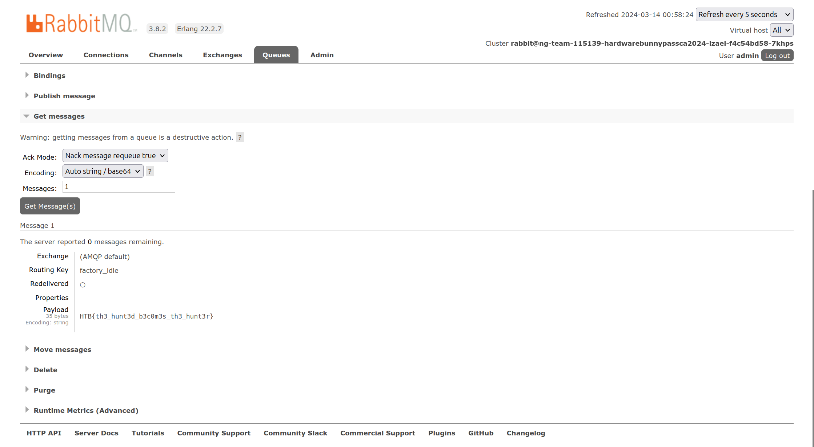

# BunnyPass

### Description

As you discovered in the PDF, the production factory of the game is revealed. This factory manufactures all the hardware devices and custom silicon chips (of common components) that The Fray uses to create sensors, drones, and various other items for the games. Upon arriving at the factory, you scan the networks and come across a RabbitMQ instance. It appears that default credentials will work.

<figure><figcaption></figcaption></figure>

### Introduction

This writeup chronicles the journey of exploiting a default-configured RabbitMQ instance encountered within the network of "The Fray's" production factory, revealing a critical vulnerability in their infrastructure.

<figure><figcaption></figcaption></figure>

### **Login**

Start by logging into the RabbitMQ dashboard using the default credentials:

```
Username = admin and Password = admin
```

<figure><figcaption></figcaption></figure>

### **Dashboard Investigation**

Upon entry, the dashboard was meticulously examined, particularly focusing on the administrative section to confirm the '`admin`' user's privileges and roles.

<figure><figcaption></figcaption></figure>

<figure><figcaption></figcaption></figure>

### **Queue Discovery**

The exploration led to the discovery of several queues, among which an '`factory_idle`' queue caught attention. This queue was earmarked for further scrutiny.

<figure><figcaption></figcaption></figure>

### **Message Retrieval**

A function labeled '`get messages`' within the queue's options was identified as a potential weak point. By adjusting the message acknowledgment setting to '`Nack`' (Negative Acknowledgment) and repeating the action several times, it was possible to coerce the system into revealing its stored messages.

<figure><figcaption></figcaption></figure>

### **Flag**

This methodical exploitation eventually led to the unveiling of the messages hidden within the queue, culminating in the capture of the coveted flag.

<figure><figcaption><p>HTB{th3_hunt3d_b3c0m3s_th3_hunt3r}</p></figcaption></figure>

## Follow Me <a href="#follow-me" id="follow-me"></a>

* **LinkedIn**: [https://www.linkedin.com/in/waris-damkham/](https://www.linkedin.com/in/waris-damkham/)
* **Website**: [https://waris-damkham.netlify.app/](https://waris-damkham.netlify.app/#home)
