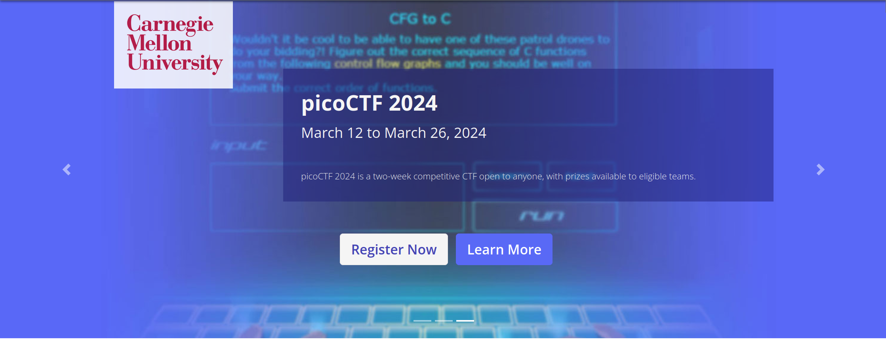

# Data Siege

### Description

"It was a tranquil night in the Phreaks headquarters, when the entire district erupted in chaos. Unknown assailants, rumored to be a rogue foreign faction, have infiltrated the city's messaging system and critical infrastructure. Garbled transmissions crackle through the airwaves, spewing misinformation and disrupting communication channels. We need to understand which data has been obtained from this attack to reclaim control of the and communication backbone. Note: flag is splitted in three parts."

<figure><figcaption></figcaption></figure>

### **Introduction**

The investigation kicked off by diving into a `capture.pcap` file through Wireshark. This step was critical for breaking down the network's exported objects and communications.

<figure><figcaption></figcaption></figure>

### **Deciphering Conversations**

<figure><figcaption></figcaption></figure>

In the web of TCP streams, one conversation stood out due to its encryption methods - a blend of AES and base64. This interaction suggested that hidden messages were waiting to be uncovered.&#x20;

<figure><figcaption></figcaption></figure>

The use of Burp Suite to decode the base64 segments led to an exciting find: readable text revealing the third part of a flag.

<figure><figcaption></figcaption></figure>

### **Exported Objects Analysis**

A deeper look into the HTTP exported objects unearthed three significant files.&#x20;

<figure><figcaption></figcaption></figure>

Among these, two instances of "nBISC4YJKs7j4I.xml" pointed towards the "aQ4caZ.exe" file.

<figure><figcaption></figcaption></figure>

### **Decrypting the Code**

<figure><figcaption></figcaption></figure>

Decompiling the "aQ4caZ.exe" file with dnSpy was the next step, which exposed the encryption key. &#x20;

<figure><figcaption></figcaption></figure>

Further exploration of the code revealed a decryption function with a hard-coded salt value.

<figure><figcaption></figcaption></figure>

This discovery paved the way to rewrite the decryption function in Python, using the uncovered key.

<figure><figcaption></figcaption></figure>

### **Flag**

With the decryption function ready, applying it to the previously found encrypted communications was the final hurdle. This effort was rewarded with the discovery of the first and second parts of the flag, piecing together the puzzle.

<figure><figcaption>
HTB{c0mmun1c4710n5_h45_b33n_r3570r3d_1n_7h3_h34dqu4r73r5}
</figcaption></figure>

## Follow Me 

* **LinkedIn**: [https://www.linkedin.com/in/waris-damkham/](https://www.linkedin.com/in/waris-damkham/)
* **Website**: [https://waris-damkham.netlify.app/](https://waris-damkham.netlify.app/#home)
