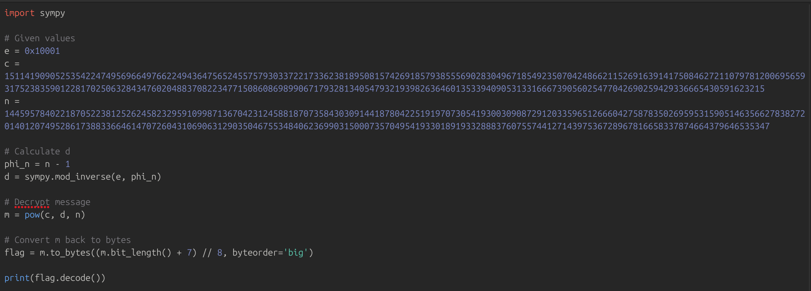

# Primary Knowledge

## Description &#x20;

Surrounded by an untamed forest and the serene waters of the Primus river, your sole objective is surviving for 24 hours. Yet, survival is far from guaranteed as the area is full of Rattlesnakes, Spiders and Alligators and the weather fluctuates unpredictably, shifting from scorching heat to torrential downpours with each passing hour. Threat is compounded by the existence of a virtual circle which shrinks every minute that passes. Anything caught beyond its bounds, is consumed by flames, leaving only ashes in its wake. As the time sleeps away, you need to prioritise your actions secure your surviving tools. Every decision becomes a matter of life and death. Will you focus on securing a shelter to sleep, protect yourself against the dangers of the wilderness, or seek out means of navigating the Primus’ waters?

<figure><figcaption></figcaption></figure>

<figure><figcaption></figcaption></figure>

<figure><figcaption></figcaption></figure>

<figure><figcaption></figcaption></figure>

<figure><figcaption></figcaption></figure>

<figure><figcaption></figcaption></figure>
