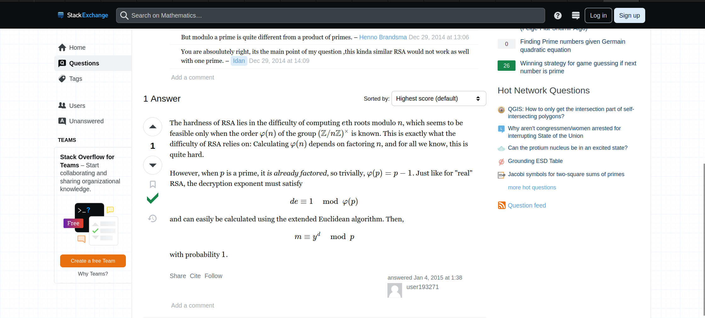

# Primary Knowledge

## Description &#x20;

Surrounded by an untamed forest and the serene waters of the Primus river, your sole objective is surviving for 24 hours. Yet, survival is far from guaranteed as the area is full of Rattlesnakes, Spiders and Alligators and the weather fluctuates unpredictably, shifting from scorching heat to torrential downpours with each passing hour. Threat is compounded by the existence of a virtual circle which shrinks every minute that passes. Anything caught beyond its bounds, is consumed by flames, leaving only ashes in its wake. As the time sleeps away, you need to prioritise your actions secure your surviving tools. Every decision becomes a matter of life and death. Will you focus on securing a shelter to sleep, protect yourself against the dangers of the wilderness, or seek out means of navigating the Primus’ waters?

<figure><figcaption></figcaption></figure>

### Introduction

The script, elegant in its simplicity, was designed to encrypt a message — the FLAG — using the RSA encryption algorithm. The cornerstone of RSA is the product of two prime numbers to form `n`, a crucial part of the public key. However, this script deviated from the established path.

```python
import math
from Crypto.Util.number import getPrime, bytes_to_long
from secret import FLAG

m = bytes_to_long(FLAG)

n = math.prod([getPrime(1024) for _ in range(2**0)])
e = 0x10001
c = pow(m, e, n)

with open('output.txt', 'w') as f:
    f.write(f'{n = }\n')
    f.write(f'{e = }\n')
    f.write(f'{c = }\n')
```

<figure><figcaption><p>This is a output.txt </p></figcaption></figure>

### The Revelation

Thanks P'North at KPMG Thailand for give me a hints, a helpful on Stack Exchange([https://math.stackexchange.com/questions/1077411/textbook-rsa-game-with-one-prime](https://math.stackexchange.com/questions/1077411/textbook-rsa-game-with-one-prime))

It became clear that the encryption used only one prime instead of two. This was not the unassailable RSA known to many but a variant weaker by design or mistake. With only one prime to contend with, the decryption became a matter not of factoring but of taking roots.

<figure><figcaption></figcaption></figure>

### The Decryption

The script to decrypt was simple: calculate the `e` root of `c` modulo `n`. Since `n` was prime, the modulo operation was straightforward, and the root revealed itself as the clear text of the flag.

```python
import sympy

e = 0x10001
c = 15114190905253542247495696649766224943647565245575793033722173362381895081574269185793855569028304967185492350704248662115269163914175084627211079781200695659317523835901228170250632843476020488370822347715086086989906717932813405479321939826364601353394090531331666739056025477042690259429336665430591623215
n = 144595784022187052238125262458232959109987136704231245881870735843030914418780422519197073054193003090872912033596512666042758783502695953159051463566278382720140120749528617388336646147072604310690631290350467553484062369903150007357049541933018919332888376075574412714397536728967816658337874664379646535347

phi_n = n - 1
d = sympy.mod_inverse(e, phi_n)

m = pow(c, d, n)

flag = m.to_bytes((m.bit_length() + 7) // 8, byteorder='big')

print(flag.decode())
```

* **Importing sympy:** The code starts by importing the `sympy` library, which provides tools for symbolic mathematics in Python, including functions relevant to number theory.
* **Given values:** The encryption exponent `e`, the ciphertext `c`, and the modulus `n` are provided. These are typically part of the public key in RSA, with `n` being the product of two primes (which should be the case but isn't here due to a mistake).
* **Calculation of `d`:** The script calculates the private exponent `d` by finding the modular multiplicative inverse of `e` modulo `phi(n)`, where `phi(n)` is the Euler's totient of `n`. Since the `n` in the script is prime, `phi(n)` is simply `n - 1`.
* **Decryption of the message:** The script then decrypts the ciphertext `c` by raising it to the power of `d` modulo `n`, which is the standard decryption process in RSA.
* **Conversion to bytes:** The decrypted message `m` is then converted from a number to a sequence of bytes, which is supposed to be the original plaintext message.
* **Decoding and printing:** Finally, the byte sequence is decoded from its byte representation into a human-readable string, which is printed out. This decoded string is expected to be the flag that was encrypted.

### Flag

<figure><figcaption></figcaption></figure>

## Follow Me <a href="#follow-me" id="follow-me"></a>

* **LinkedIn**: [https://www.linkedin.com/in/waris-damkham/](https://www.linkedin.com/in/waris-damkham/)
* **Website**: [https://waris-damkham.netlify.app/](https://waris-damkham.netlify.app/#home)
