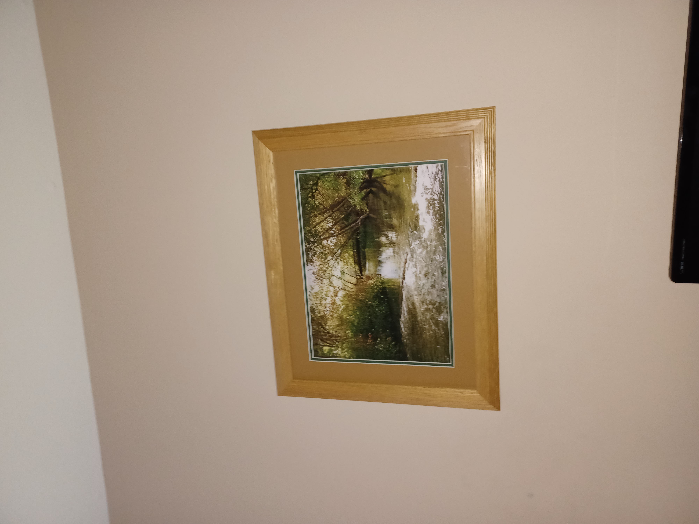

# Blast from the past

```markdown
Tags: `Forensics` `browser_webshell_solvable` `metadata`
```

## **Description**

The judge for these pictures is a real fan of antiques. Can you age this photo to the specifications? Set the timestamps on this picture to `1970:01:01 00:00:00.001+00:00` with as much precision as possible for each timestamp. In this example, `+00:00` is a timezone adjustment. Any timezone is acceptable as long as the time is equivalent. As an example, this timestamp is acceptable as well: `1969:12:31 19:00:00.001-05:00`. For timestamps without a timezone adjustment, put them in GMT time (+00:00). The checker program provides the timestamp needed for each.

<figure><figcaption></figcaption></figure>

## **Solution Strategy**

```sh
exiftool '-AllDates=1970:01:01 00:00:00.001' -OffsetTime="+00:00" original.jpg

exiftool -SubSecTime="001" -SubSecTimeOriginal="001" -SubSecTimeDigitized="001" original.jpg
```

<figure><figcaption></figcaption></figure>

<figure><figcaption></figcaption></figure>

```bash
hexedit original.jpg
#Change 170051381420 -> 000000000001
```

<figure><figcaption></figcaption></figure>

```
ExifTool Version Number         : 12.65
File Name                       : original.jpg
Directory                       : .
File Size                       : 2.9 MB
File Modification Date/Time     : 2024:03:18 21:59:22+07:00
File Access Date/Time           : 2024:03:18 21:59:22+07:00
File Inode Change Date/Time     : 2024:03:18 21:59:22+07:00
File Permissions                : -rw-rw-r--
File Type                       : JPEG
File Type Extension             : jpg
MIME Type                       : image/jpeg
Exif Byte Order                 : Little-endian (Intel, II)
Image Description               : 
Make                            : samsung
Camera Model Name               : SM-A326U
Orientation                     : Rotate 90 CW
X Resolution                    : 72
Y Resolution                    : 72
Resolution Unit                 : inches
Software                        : MediaTek Camera Application
Modify Date                     : 1970:01:01 00:00:00
Y Cb Cr Positioning             : Co-sited
Exposure Time                   : 1/24
F Number                        : 1.8
Exposure Program                : Program AE
ISO                             : 500
Sensitivity Type                : Unknown
Recommended Exposure Index      : 0
Exif Version                    : 0220
Date/Time Original              : 1970:01:01 00:00:00
Create Date                     : 1970:01:01 00:00:00
Offset Time                     : +00:00
Components Configuration        : Y, Cb, Cr, -
Shutter Speed Value             : 1/24
Aperture Value                  : 1.9
Brightness Value                : 3
Exposure Compensation           : 0
Max Aperture Value              : 1.8
Metering Mode                   : Center-weighted average
Light Source                    : Other
Flash                           : On, Fired
Focal Length                    : 4.6 mm
Sub Sec Time                    : 001
Sub Sec Time Original           : 001
Sub Sec Time Digitized          : 001
Flashpix Version                : 0100
Color Space                     : sRGB
Exif Image Width                : 4000
Exif Image Height               : 3000
Interoperability Index          : R98 - DCF basic file (sRGB)
Interoperability Version        : 0100
Exposure Mode                   : Auto
White Balance                   : Auto
Digital Zoom Ratio              : 1
Focal Length In 35mm Format     : 25 mm
Scene Capture Type              : Standard
Compression                     : JPEG (old-style)
Thumbnail Offset                : 1144
Thumbnail Length                : 64000
Image Width                     : 4000
Image Height                    : 3000
Encoding Process                : Baseline DCT, Huffman coding
Bits Per Sample                 : 8
Color Components                : 3
Y Cb Cr Sub Sampling            : YCbCr4:2:0 (2 2)
Time Stamp                      : 1970:01:01 07:00:00.001+07:00
MCC Data                        : United States / Guam (310)
Aperture                        : 1.8
Image Size                      : 4000x3000
Megapixels                      : 12.0
Scale Factor To 35 mm Equivalent: 5.4
Shutter Speed                   : 1/24
Create Date                     : 1970:01:01 00:00:00.001
Date/Time Original              : 1970:01:01 00:00:00.001
Modify Date                     : 1970:01:01 00:00:00.001+00:00
Thumbnail Image                 : (Binary data 64000 bytes, use -b option to extract)
Circle Of Confusion             : 0.006 mm
Field Of View                   : 71.5 deg
Focal Length                    : 4.6 mm (35 mm equivalent: 25.0 mm)
Hyperfocal Distance             : 2.13 m
Light Value                     : 4.0
```

## Flag

```
MD5 of your picture:
6bc3fc93ab60e34d0284e37ee2066f2c  test.out

Checking tag 1/7
Looking at IFD0: ModifyDate
Looking for '1970:01:01 00:00:00'
Found: 1970:01:01 00:00:00
Great job, you got that one!

Checking tag 2/7
Looking at ExifIFD: DateTimeOriginal
Looking for '1970:01:01 00:00:00'
Found: 1970:01:01 00:00:00
Great job, you got that one!

Checking tag 3/7
Looking at ExifIFD: CreateDate
Looking for '1970:01:01 00:00:00'
Found: 1970:01:01 00:00:00
Great job, you got that one!

Checking tag 4/7
Looking at Composite: SubSecCreateDate
Looking for '1970:01:01 00:00:00.001'
Found: 1970:01:01 00:00:00.001
Great job, you got that one!

Checking tag 5/7
Looking at Composite: SubSecDateTimeOriginal
Looking for '1970:01:01 00:00:00.001'
Found: 1970:01:01 00:00:00.001
Great job, you got that one!

Checking tag 6/7
Looking at Composite: SubSecModifyDate
Looking for '1970:01:01 00:00:00.001'
Found: 1970:01:01 00:00:00.001
Great job, you got that one!

Checking tag 7/7
Timezones do not have to match, as long as it's the equivalent time.
Looking at Samsung: TimeStamp
Looking for '1970:01:01 00:00:00.001+00:00'
Found: 1970:01:01 00:00:00.001+00:00
Great job, you got that one!
```

<figure><figcaption></figcaption></figure>

## Follow Me

* **LinkedIn**: [https://www.linkedin.com/in/waris-damkham/](https://www.linkedin.com/in/waris-damkham/)
* **Website**: [https://waris-damkham.netlify.app/](https://waris-damkham.netlify.app/#home)
