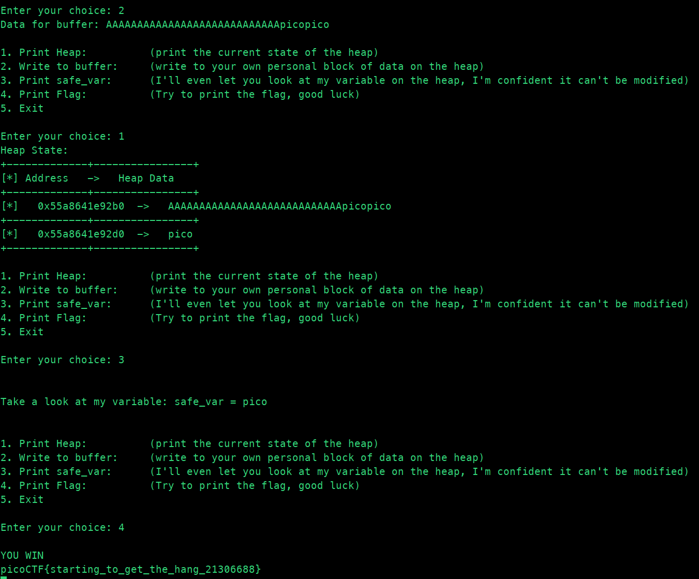

# heap 1

```markdown
Tags: `Binary Exploitation` `heap` `browser_webshell_solvable`
```

## **Description**

Are overflows just a stack concern?

<figure><figcaption></figcaption></figure>

## Source Code

```c
#include <stdio.h>
#include <stdlib.h>
#include <string.h>

#define FLAGSIZE_MAX 64
// amount of memory allocated for input_data
#define INPUT_DATA_SIZE 5
// amount of memory allocated for safe_var
#define SAFE_VAR_SIZE 5

int num_allocs;
char *safe_var;
char *input_data;

void check_win() {
    if (!strcmp(safe_var, "pico")) {
        printf("\nYOU WIN\n");

        // Print flag
        char buf[FLAGSIZE_MAX];
        FILE *fd = fopen("flag.txt", "r");
        fgets(buf, FLAGSIZE_MAX, fd);
        printf("%s\n", buf);
        fflush(stdout);

        exit(0);
    } else {
        printf("Looks like everything is still secure!\n");
        printf("\nNo flage for you :(\n");
        fflush(stdout);
    }
}

void print_menu() {
    printf("\n1. Print Heap:\t\t(print the current state of the heap)"
           "\n2. Write to buffer:\t(write to your own personal block of data "
           "on the heap)"
           "\n3. Print safe_var:\t(I'll even let you look at my variable on "
           "the heap, "
           "I'm confident it can't be modified)"
           "\n4. Print Flag:\t\t(Try to print the flag, good luck)"
           "\n5. Exit\n\nEnter your choice: ");
    fflush(stdout);
}

void init() {
    printf("\nWelcome to heap1!\n");
    printf(
        "I put my data on the heap so it should be safe from any tampering.\n");
    printf("Since my data isn't on the stack I'll even let you write whatever "
           "info you want to the heap, I already took care of using malloc for "
           "you.\n\n");
    fflush(stdout);
    input_data = malloc(INPUT_DATA_SIZE);
    strncpy(input_data, "pico", INPUT_DATA_SIZE);
    safe_var = malloc(SAFE_VAR_SIZE);
    strncpy(safe_var, "bico", SAFE_VAR_SIZE);
}

void write_buffer() {
    printf("Data for buffer: ");
    fflush(stdout);
    scanf("%s", input_data);
}

void print_heap() {
    printf("Heap State:\n");
    printf("+-------------+----------------+\n");
    printf("[*] Address   ->   Heap Data   \n");
    printf("+-------------+----------------+\n");
    printf("[*]   %p  ->   %s\n", input_data, input_data);
    printf("+-------------+----------------+\n");
    printf("[*]   %p  ->   %s\n", safe_var, safe_var);
    printf("+-------------+----------------+\n");
    fflush(stdout);
}

int main(void) {

    // Setup
    init();
    print_heap();

    int choice;

    while (1) {
        print_menu();
	if (scanf("%d", &choice) != 1) exit(0);

        switch (choice) {
        case 1:
            // print heap
            print_heap();
            break;
        case 2:
            write_buffer();
            break;
        case 3:
            // print safe_var
            printf("\n\nTake a look at my variable: safe_var = %s\n\n",
                   safe_var);
            fflush(stdout);
            break;
        case 4:
            // Check for win condition
            check_win();
            break;
        case 5:
            // exit
            return 0;
        default:
            printf("Invalid choice\n");
            fflush(stdout);
        }
    }
}
```

* This C program is a heap-based challenge with a menu-driven interface similar to the previous one.
* It initializes two heap-allocated variables: `input_data` and `safe_var`, both with sizes of 5 bytes.
* The `init` function initializes the program by printing a welcome message and setting initial values for `input_data` and `safe_var`.
* The `print_menu` function prints a menu for the user to choose from various options.
* The `write_buffer` function allows the user to write data to their personal block of data (`input_data`) on the heap.
* The `print_heap` function prints the current state of the heap, showing the addresses and data stored in `input_data` and `safe_var`.
* The `check_win` function compares the value of `safe_var` with the string `"pico"`. If they match, it prints the flag stored in `flag.txt` and exits. Otherwise, it prints a message indicating that everything is secure.
* The `main` function runs the main loop of the program, continuously displaying the menu and executing the corresponding actions based on the user's choice.
* It handles user input validation and ensures the program continues running until the user chooses to exit.

## Flag

<figure><figcaption></figcaption></figure>

## Follow Me

* **LinkedIn**: [https://www.linkedin.com/in/waris-damkham/](https://www.linkedin.com/in/waris-damkham/)
* **Website**: [https://waris-damkham.netlify.app/](https://waris-damkham.netlify.app/#home)
