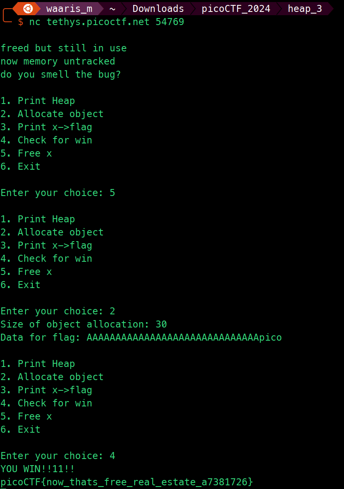

# heap 3

```markdown
Tags: `Binary Exploitation` `heap` `browser_webshell_solvable`
```

## **Description**

Can you handle function pointers?

<figure><figcaption></figcaption></figure>

## Source Code

```c
#include <stdio.h>
#include <stdlib.h>
#include <string.h>

#define FLAGSIZE_MAX 64

// Create struct
typedef struct {
  char a[10];
  char b[10];
  char c[10];
  char flag[5];
} object;

int num_allocs;
object *x;

void check_win() {
  if(!strcmp(x->flag, "pico")) {
    printf("YOU WIN!!11!!\n");

    // Print flag
    char buf[FLAGSIZE_MAX];
    FILE *fd = fopen("flag.txt", "r");
    fgets(buf, FLAGSIZE_MAX, fd);
    printf("%s\n", buf);
    fflush(stdout);

    exit(0);

  } else {
    printf("No flage for u :(\n");
    fflush(stdout);
  }
  // Call function in struct
}

void print_menu() {
    printf("\n1. Print Heap\n2. Allocate object\n3. Print x->flag\n4. Check for win\n5. Free x\n6. "
           "Exit\n\nEnter your choice: ");
    fflush(stdout);
}

// Create a struct
void init() {

    printf("\nfreed but still in use\nnow memory untracked\ndo you smell the bug?\n");
    fflush(stdout);

    x = malloc(sizeof(object));
    strncpy(x->flag, "bico", 5);
}

void alloc_object() {
    printf("Size of object allocation: ");
    fflush(stdout);
    int size = 0;
    scanf("%d", &size);
    char* alloc = malloc(size);
    printf("Data for flag: ");
    fflush(stdout);
    scanf("%s", alloc);
}

void free_memory() {
    free(x);
}

void print_heap() {
    printf("[*]   Address   ->   Value   \n");
    printf("+-------------+-----------+\n");
    printf("[*]   %p  ->   %s\n", x->flag, x->flag);
    printf("+-------------+-----------+\n");
    fflush(stdout);
}

int main(void) {

    // Setup
    init();

    int choice;

    while (1) {
        print_menu();
	if (scanf("%d", &choice) != 1) exit(0);

        switch (choice) {
        case 1:
            // print heap
            print_heap();
            break;
        case 2:
            alloc_object();
            break;
        case 3:
            // print x
            printf("\n\nx = %s\n\n", x->flag);
            fflush(stdout);
            break;
        case 4:
            // Check for win condition
            check_win();
            break;
        case 5:
            free_memory();
            break;
        case 6:
            // exit
            return 0;
        default:
            printf("Invalid choice\n");
            fflush(stdout);
        }
    }
}
```

* This C program presents a menu-driven interface where the user can perform various actions.
* It defines a struct `object` containing four character arrays: `a`, `b`, `c`, and `flag`.
* The `init` function initializes the program by allocating memory for an instance of the `object` struct and setting an initial value for the `flag` member.
* The `alloc_object` function dynamically allocates memory based on user input and prompts the user to enter data for the `flag` member.
* The `free_memory` function frees the memory allocated for the `object` struct.
* The `print_heap` function prints the address and value of the `flag` member of the `object` struct.
* The `check_win` function checks if the value of the `flag` member equals `"pico"`. If so, it prints the flag stored in "flag.txt" and exits; otherwise, it prints a message indicating failure.
* The `print_menu` function prints a menu for the user to choose from various options.
* The `main` function runs the main loop of the program, continuously displaying the menu and executing the corresponding actions based on the user's choice.
* It handles user input validation and ensures the program continues running until the user chooses to exit.

## Flag

<figure><figcaption></figcaption></figure>

## Follow Me

* **LinkedIn**: [https://www.linkedin.com/in/waris-damkham/](https://www.linkedin.com/in/waris-damkham/)
* **Website**: [https://waris-damkham.netlify.app/](https://waris-damkham.netlify.app/#home)
