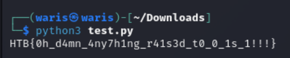

# Scan Surprise

```markdown
Tags: `Forensics` `qr_code` `browser_webshell_solvable` `shell`
```

## **Description**

I've gotten bored of handing out flags as text. Wouldn't it be cool if they were an image instead?

<figure><figcaption><p>QR-CODE IN SOURCE CODE</p></figcaption></figure>

## Flag

Thanks [https://me-qr-scanner.com/qr-scanner](https://me-qr-scanner.com/qr-scanner)

<figure><figcaption><p>picoCTF{p33k_@_b00_b5ce2572}</p></figcaption></figure>

## Follow Me

* **LinkedIn**: [https://www.linkedin.com/in/waris-damkham/](https://www.linkedin.com/in/waris-damkham/)
* **Website**: [https://waris-damkham.netlify.app/](https://waris-damkham.netlify.app/#home)
