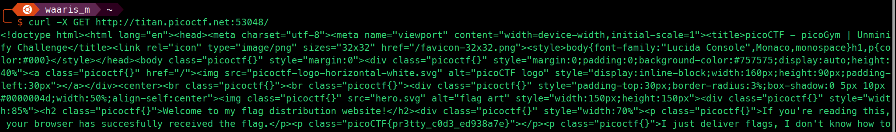

# Unminify

```markdown
Tags: `Web Exploitation` `obfuscation` `browser_webshell_solvable` `minification`
```

## **Description**

I don't like scrolling down to read the code of my website, so I've squished it. As a bonus, my pages load faster! Browse here, and find the flag!

<figure><figcaption></figcaption></figure>

## Flag

<figure><figcaption></figcaption></figure>

## Follow Me

* **LinkedIn**: [https://www.linkedin.com/in/waris-damkham/](https://www.linkedin.com/in/waris-damkham/)
* **Website**: [https://waris-damkham.netlify.app/](https://waris-damkham.netlify.app/#home)
